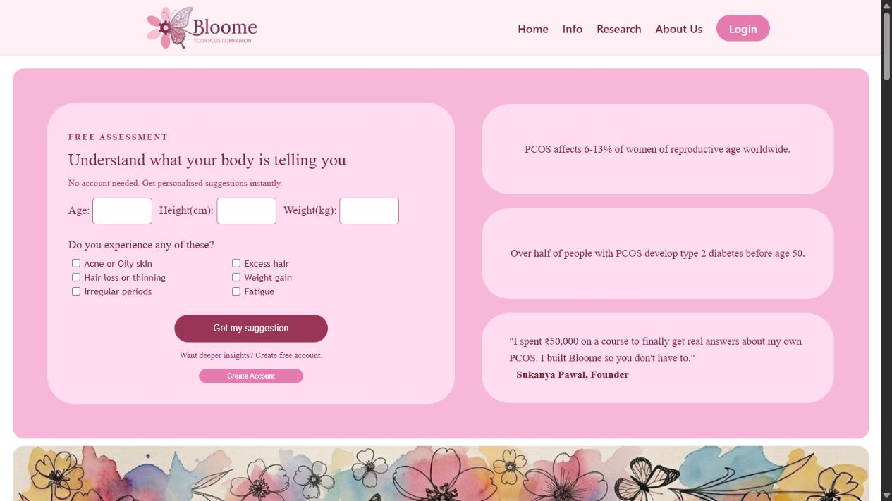
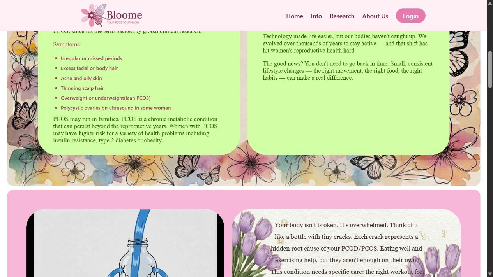
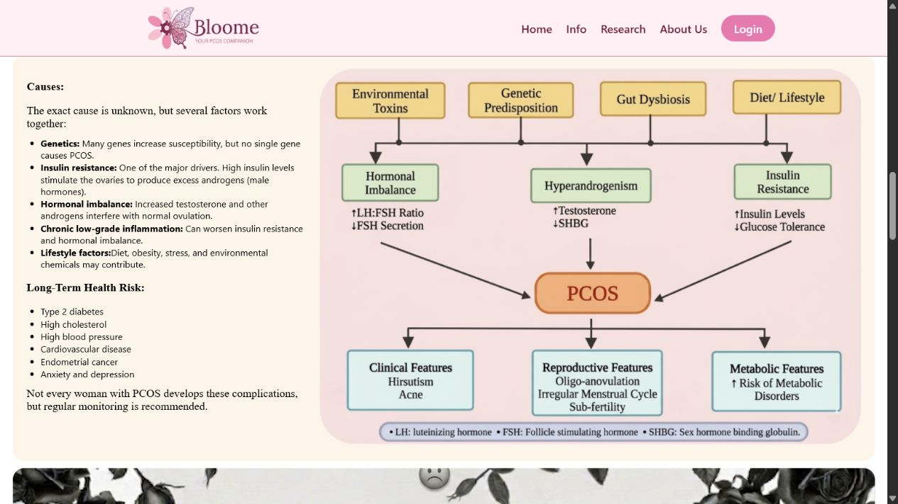
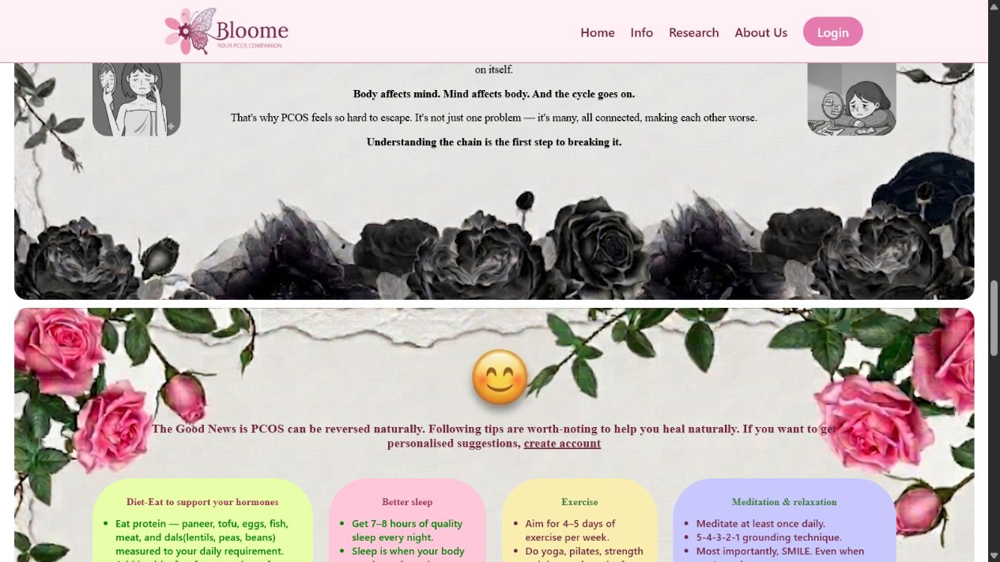
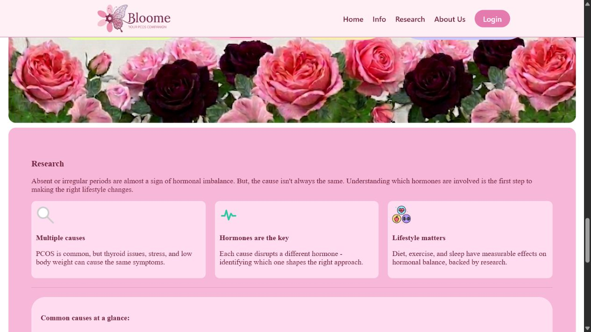
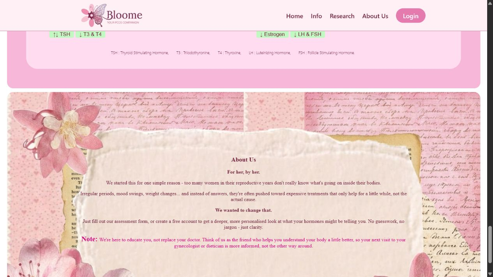

# PCOS Management

## Home page













## Run locally

Requires Node.js 22.5 or newer (Node 24 is installed on this machine).

```bash
npm start
```

Open http://localhost:3000. The first run creates `pcos-management.db` automatically.

## Authentication

- `POST /api/auth/signup` creates a user with an scrypt-hashed password.
- `POST /api/auth/login` creates an HttpOnly, SameSite session cookie.
- `GET /api/auth/me` returns the signed-in user.
- `POST /api/auth/logout` ends the active session.

Google and Apple buttons are intentionally visual-only until OAuth credentials and callback URLs are configured.

## Google and Twitter/X sign-in

The Google and Twitter/X buttons are implemented using OAuth 2.0. Configure secrets as environment variables (do not add them to source control):

```powershell
$env:GOOGLE_CLIENT_ID = '...'
$env:GOOGLE_CLIENT_SECRET = '...'
$env:TWITTER_CLIENT_ID = '...'
$env:TWITTER_CLIENT_SECRET = '...'
npm start
```

In the Google Cloud Console, register `http://localhost:3000/api/oauth/google/callback` as an authorized redirect URI. In the X Developer Console, enable OAuth 2.0 for a **Web App**, request `users.read` and `users.email`, and register `http://127.0.0.1:3000/api/oauth/twitter/callback` as the callback URL. For a deployed app, set `APP_URL` to its public HTTPS URL and register the equivalent HTTPS callbacks.
